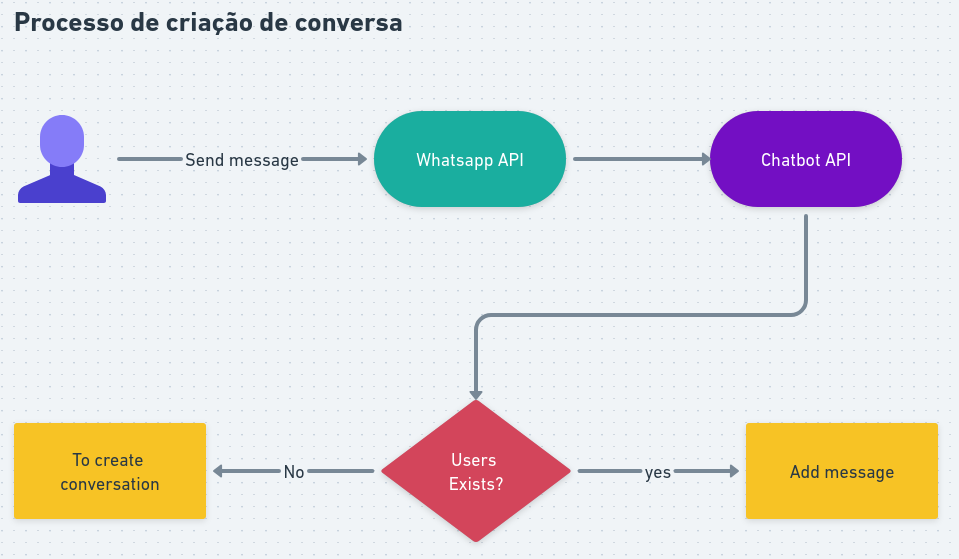

## 🎯 BOTHUB

Esse projeto tem o objetivo de estabelecer o gerenciamento de relacionamento com o cliente através da integração das
conversas pelo whatsapp entre empresa e cliente.

## FLUXO DE PROCESSOS



## OBSERVAÇÕES TÉCNICAS - Ajuda ao aprendizado

Nesse projeto foi implementado e refatorado para clean code. Pode se observar isso no caso de uso que contém a lógica de
criação de mensagem. Resumidamente os passos do algorítimo estão definidos dessa maneira:

1. Verifica se o usuário existe na base de dados
2. Se sim, ele chama a função `handleExistingUser` que busca o usuário pelo telefone e apartir dai adiciona a mensagem
   a uma conversa existente.
3. Se não ele chama a funçao `handleNewUser` que cria um novo usuário, cria uma nova conversa e adiciona a mensagem à
   ela

- Repare que os métodos são pequenos, nomeclaturas claras e fluxo simplificaso de entendimento.

```java

@RequiredArgsConstructor
public class CreateMessageUseCase {

    private static final Logger LOGGER = LoggerFactory.getLogger(CreateMessageUseCase.class);
    private static final UUID SYSTEM_USER_ID = UUID.fromString("698b1b94-07e9-4f8f-9854-514911b7ef06");

    private final MessageRepositoryGateway messageRepositoryGateway;
    private final CreateUserUseCase createUserUseCase;
    private final FindByPhoneNumberUseCase findByPhoneNumberUseCase;
    private final CreateConversationUsecase createConversationUsecase;
    private final UserRepositoryGateway userRepositoryGateway;
    private final FindConversationByUserIdUseCase findConversationByUserIdUseCase;

    public Mono<Void> createMessage(String phone, String messageContent) {
        User defaultUser = buildDefaultUser(phone);
        return userRepositoryGateway.existsByPhoneNumber(phone)
                .flatMap(exists -> exists ? handleExistingUser(phone, messageContent) : handleNewUser(defaultUser, messageContent));
    }

    private Mono<Void> handleNewUser(User user, String messageContent) {
        LOGGER.info("Novo usuário: {}", user);
        return createUserUseCase.execute(user)
                .flatMap(createdUser -> createConversationForUser(createdUser)
                        .flatMap(conversation -> saveMessage(conversation.getId(), createdUser.getId(), messageContent)));
    }

    private Mono<Void> handleExistingUser(String phone, String messageContent) {
        LOGGER.info("Usuário já existe com telefone: {}", phone);
        return findByPhoneNumberUseCase.execute(phone)
                .flatMap(user -> findConversationByUserIdUseCase.execute(user.getId())
                        .flatMap(conversation -> saveMessage(conversation.getId(), user.getId(), messageContent)));
    }

    private Mono<Conversation> createConversationForUser(User user) {
        Conversation conversation = Conversation.builder()
                .userOneId(SYSTEM_USER_ID)
                .userTwoId(user.getId())
                .createdAt(LocalDateTime.now())
                .build();
        return createConversationUsecase.createConversation(conversation);
    }

    private Mono<Void> saveMessage(UUID conversationId, UUID senderId, String content) {
        Message message = buildMessage(conversationId, senderId, content);
        return messageRepositoryGateway.createMessage(message).then();
    }

    private User buildDefaultUser(String phone) {
        return User.builder()
                .name("cliente")
                .phoneNumber(phone)
                .build();
    }

    private Message buildMessage(UUID conversationId, UUID senderId, String content) {
        return Message.builder()
                .conversationId(conversationId)
                .content(content)
                .senderId(senderId)
                .timestamp(LocalDateTime.now())
                .build();
    }
}
```
